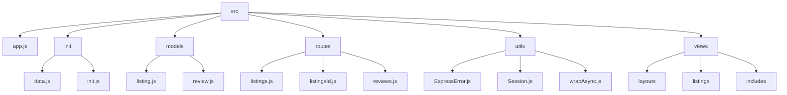
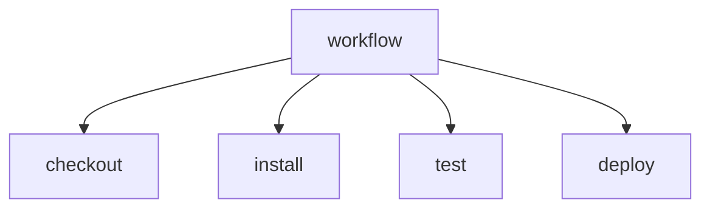

# Wonderlust 🌏

## 🗂️ Description

Wonderlust is a full-stack web application built with Express.js, EJS, and MongoDB. It's designed to allow users to create, view, and manage listings, which can include details like title, description, image, price, location, and country. The application also supports user reviews for each listing. This project is ideal for developers looking to understand how to build a robust web application with data modeling, routing, and user interaction.

## ✨ Key Features

### **Listings Management** 📝
- Create new listings with details like title, description, image URL, price, location, and country.
- View a list of all listings with essential details.
- Show detailed information about individual listings, including reviews.
- Edit and update existing listings.

### **Reviews Management** 💬
- Create new reviews for listings with a comment and rating.
- View all reviews for a listing.

### **User Interface** 🌐
- Navigation bar with links to home, listings, and actions like adding new listings, signing up, and logging in.
- Responsive design with Bootstrap.

### **Error Handling** ⚠️
- Custom error handling with Express error handling middleware.
- Display error messages to users.

## 🗂️ Folder Structure



## 🛠️ Tech Stack


## ⚙️ Setup Instructions

1. **Clone the Repository**
   ```bash
git clone https://github.com/night-spring/Wonderlust.git
```
2. **Install Dependencies**
   ```bash
cd Wonderlust
npm install
```
3. **Start the Application**
   ```bash
npm start
```
4. **Access the Application**
   Open your browser and navigate to `http://localhost:3000`.

## 🤖 GitHub Actions

This repository uses GitHub Actions for automated testing and deployment. The workflow is defined in `.github/workflows/main.yml` and includes steps for installing dependencies, running tests, and deploying to a production environment.




<br><br>
<div align="center">

<h3>Debojit Roy</h3>
<p>Focused on backend development and machine learning.</p>
</div>
<br>
<p align="right">
  <a href="https://gitfull.vercel.app">Made by GitFull</a>
</p>
    